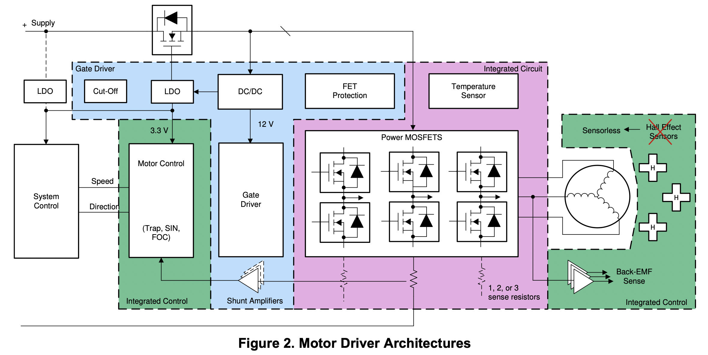

# BLDC

## BLDC Motor Driver Architecture
3 key building blocks for BLDC motor driver are: 
1. Motor controller, typically a MCU
2. Gate Drivers; PWM input, output drives half-bridges
3. Power MOSFET in half-bridges
4. Senseored feedback

<figcaption>Source: TI</figcaption>
